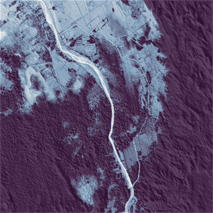
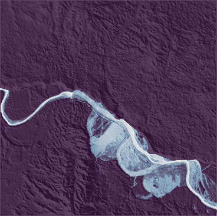

# Relative Elevation Model (REM) Tutorial
> This is a forked repo form [DahnJ/REM-xarray](https://github.com/DahnJ/REM-xarray)


| Piura | Sullana |
| --- | --- |
|  |  |


# Relative Elevation Model 

Based on Creating a [relative elevation model](https://ngmdb.usgs.gov/Info/dmt/docs/DMT16_Coe.pdf) in Python using [xarray](https://xarray.pydata.org/) and [datashader](https://datashader.org/) by [Dahn Jahn](https://github.com/DahnJ)

# Results

### Piura
| Area of Interest | REM |
| --- | --- |
|  |  |

### Sullana
| Area of Interest | REM |
| --- | --- |
|  |  |

# Run locally

### Conda
```bash
conda env create -f environment.yaml
conda activate rem-tutorial
jupyter notebook
```

### venv
```bash
python -m venv rem-tutorial
source rem-tutorial/bin/activate
pip install -r requirements.txt
jupyter notebook
```